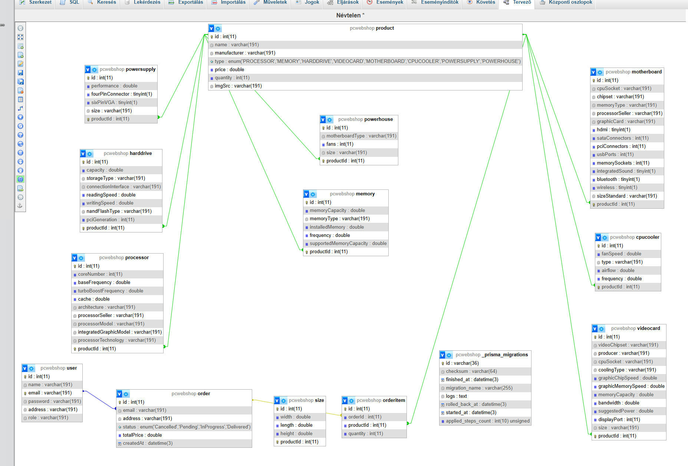

# Műszaki Dokumentáció: Pixelforge Admin

## Projekt Áttekintés

A Pixelforge Admin egy Electron-alapú asztali alkalmazás, amely React, TypeScript és Redux segítségével készült. Az alkalmazás egy e-kereskedelmi platform adminisztrációs felületeként szolgál, amely számítógépes hardverek és komponensek kezelésére specializálódott.

## Technológiai Stack

### Alapvető Technológiák
- **Electron**: Keretrendszer platformfüggetlen asztali alkalmazások fejlesztéséhez
- **React**: Frontend könyvtár felhasználói felületek készítéséhez
- **TypeScript**: Típusos JavaScript a jobb fejlesztői élmény érdekében
- **Redux Toolkit**: Állapotkezelési megoldás
- **React Router**: Kliensoldali útválasztás

### UI Könyvtárak
- **Ant Design**: UI komponens könyvtár
- **Tailwind CSS**: Utility-first CSS keretrendszer
- **React Icons**: Ikon könyvtár
- **Lucide React**: További ikon könyvtár
- **Sonner**: Toast értesítési könyvtár

### Backend Kommunikáció
- **Axios**: HTTP kliens API kérésekhez
- **JWT**: JSON Web Token hitelesítéshez

## Projekt Struktúra

```
webshop_asztali/
├── dist-electron/       # Fordított Electron kód
├── dist-react/          # Fordított React UI kód
├── src/                 # Forráskód
│   ├── electron/        # Electron fő folyamat kódja
│   │   └── main.ts      # Electron fő belépési pont
│   └── ui/              # React UI kód
│       ├── assets/      # Statikus erőforrások
│       ├── companents/  # UI komponensek funkció szerint rendezve
│       │   ├── common/  # Megosztott komponensek
│       │   ├── layout/  # Elrendezési komponensek
│       │   ├── login/   # Hitelesítési komponensek
│       │   ├── order/   # Rendeléskezelő komponensek
│       │   ├── product/ # Termékkezelő komponensek
│       │   ├── profile/ # Felhasználói profil komponensek
│       │   ├── setting/ # Beállítási komponensek
│       │   └── user/    # Felhasználókezelő komponensek
│       ├── hooks/       # Egyedi React hook-ok
│       ├── misch/       # Egyéb segédeszközök
│       │   ├── store/   # Redux store szeletek
│       │   ├── Axios.ts # Axios konfiguráció
│       │   └── Store.ts # Redux store konfiguráció
│       ├── pages/       # Oldal komponensek
│       │   └── product/ # Termékkel kapcsolatos oldalak
│       ├── router/      # Útválasztási konfiguráció
│       │   └── index.tsx # Fő router beállítás
│       └── style/       # Stílusfájlok
├── package.json         # Projekt függőségek és szkriptek
└── vite.config.ts       # Vite konfiguráció
```

## Architektúra

### Electron Fő Folyamat
Az Electron fő folyamat (`src/electron/main.ts`) felelős az alkalmazás ablak létrehozásáért és az alkalmazás életciklusának kezeléséért. Konfigurálja az ablak méreteit, megjelenését és betölti a React UI-t.

### React UI
A React UI funkció-alapú architektúrát használ, ahol a komponensek, állapotok és logika funkció szerint vannak csoportosítva, nem pedig típus szerint. Ez a kódbázist karbantarthatóbbá és skálázhatóbbá teszi.

### Állapotkezelés
Az alkalmazás Redux Toolkit-et használ az állapotkezeléshez, a következő fő szeletekkel:
- **Auth**: Hitelesítési állapot kezelése (bejelentkezés, kijelentkezés, tokenek)
- **Settings**: Alkalmazás beállítások és preferenciák kezelése

### Útválasztás
Az alkalmazás React Router-t használ a navigációhoz. Az útvonalak hitelesítéssel védettek, nem engedélyezett felhasználókat a bejelentkezési oldalra irányít. A fő útvonalak:
- `/login`: Hitelesítési oldal
- `/products`: Termékkezelés
- `/users`: Felhasználókezelés
- `/orders`: Rendeléskezelés
- `/setting`: Alkalmazás beállítások
- `/profile`: Felhasználói profil

A termék létrehozási munkafolyamathoz beágyazott útválasztási struktúra van implementálva.

## Adatbázis Modell

### Adatbázis Diagram


### Tábla Leírások

#### Users
Adminisztrátor felhasználói információk tárolása.
- `id` (INT): Elsődleges kulcs, automatikusan növekvő
- `username` (VARCHAR): Egyedi felhasználónév, kötelező
- `password_hash` (VARCHAR): Argon2 hashelt jelszó, kötelező
- `email` (VARCHAR): Egyedi email cím, kötelező
- `role` (ENUM): Felhasználói szerepkör ('admin', 'manager', 'staff')
- `created_at` (TIMESTAMP): Fiók létrehozásának ideje
- `last_login` (TIMESTAMP): Utolsó bejelentkezés időpontja

#### Products
Különböző számítógépes komponensek termékinformációinak tárolása.
- `id` (INT): Elsődleges kulcs, automatikusan növekvő
- `name` (VARCHAR): Termék neve, kötelező
- `type` (ENUM): Termék típusa ('processor', 'motherboard', 'memory', stb.)
- `price` (DECIMAL): Termék ára, kötelező
- `stock` (INT): Elérhető készlet, minimum 0
- `description` (TEXT): Termék leírása
- `image_url` (VARCHAR): Termék képének elérési útja

#### Orders
Vásárlói rendelések nyilvántartása.
- `id` (INT): Elsődleges kulcs, automatikusan növekvő
- `customer_id` (INT): Külső kulcs a customers táblához
- `status` (ENUM): Rendelés állapota ('pending', 'processing', 'shipped', 'delivered', 'cancelled')
- `total_amount` (DECIMAL): Teljes rendelési összeg
- `created_at` (TIMESTAMP): Rendelés létrehozásának ideje
- `updated_at` (TIMESTAMP): Utolsó frissítés időpontja

#### OrderItems
Rendelések egyedi tételeinek tárolása.
- `id` (INT): Elsődleges kulcs, automatikusan növekvő
- `order_id` (INT): Külső kulcs az orders táblához
- `product_id` (INT): Külső kulcs a products táblához
- `quantity` (INT): Tételek száma, minimum 1
- `price` (DECIMAL): Vásárláskori ár

## Hitelesítés

Az alkalmazás JWT-alapú hitelesítést használ:
- A felhasználói hitelesítő adatokat a backend API ellenőrzi
- A JWT tokenek localStorage-ban tárolódnak a perzisztencia érdekében
- A védett útvonalak ellenőrzik a hitelesítési állapotot a megjelenítés előtt
- Az alkalmazás automatikusan megpróbál bejelentkezni a tárolt hitelesítő adatokkal

## API Kommunikáció

Az API kéréseket egy konfigurált Axios példány (`src/ui/misch/Axios.ts`) kezeli. A konfiguráció tartalmazza:
- Alap URL konfigurációt
- Kérés/válasz interceptorokat
- Engedélyezési fejléc kezelést
- Hibakezelést

### API Végpontok

#### Hitelesítés
- `POST /api/auth/login`: Felhasználó hitelesítése és JWT token lekérése
- `POST /api/auth/logout`: Munkamenet érvénytelenítése
- `GET /api/auth/profile`: Aktuális felhasználói profil lekérése

#### Termékek
- `GET /api/products`: Termékek listázása opcionális szűréssel
- `GET /api/products/:id`: Konkrét termék részleteinek lekérése
- `POST /api/products`: Új termék létrehozása
- `PUT /api/products/:id`: Meglévő termék frissítése
- `DELETE /api/products/:id`: Termék eltávolítása

#### Felhasználók
- `GET /api/users`: Felhasználók listázása
- `GET /api/users/:id`: Konkrét felhasználó részleteinek lekérése
- `POST /api/users`: Új felhasználó létrehozása
- `PUT /api/users/:id`: Meglévő felhasználó frissítése
- `DELETE /api/users/:id`: Felhasználó eltávolítása

#### Rendelések
- `GET /api/orders`: Rendelések listázása
- `GET /api/orders/:id`: Konkrét rendelés részleteinek lekérése
- `POST /api/orders`: Új rendelés létrehozása
- `PUT /api/orders/:id`: Rendelés állapotának frissítése

## Telepítési Útmutató

### Fejlesztői Környezet Beállítása

#### Előfeltételek
- Node.js (v16.x vagy újabb)
- npm (v8.x vagy újabb)
- Git

#### Telepítési Lépések
1. Klónozza a repository-t:
   ```
   git clone https://github.com/your-username/webshop_asztali.git
   cd webshop_asztali
   ```

2. Telepítse a függőségeket:
   ```
   npm install
   ```

3. Fordítsa az Electron TypeScript kódot:
   ```
   npm run transpile:electron
   ```

4. Indítsa el a fejlesztői szervert:
   ```
   npm run dev
   ```

5. Indítsa el az Electron-t:
   ```
   npm run dev:electron
   ```

### telepitő létrehozzása

Különböző platformokra való termelési build létrehozása:

#### Windows
```
npm run dist:win
```
A parancs automatikusan kezeli az Electron kód fordítását, a React UI buildelését és az alkalmazás Windows-ra való csomagolását.

#### macOS
```
npm run dist:mac
```
A parancs automatikusan kezeli az Electron kód fordítását, a React UI buildelését és az alkalmazás macOS-re való csomagolását.

#### Linux
```
npm run dist:linux
```
A parancs automatikusan kezeli az Electron kód fordítását, a React UI buildelését és az alkalmazás Linux-ra való csomagolását.

A buildelt alkalmazás a `dist` könyvtárban lesz elérhető.

## Fejlesztési Munkafolyamat

1. Végezzen módosításokat a forráskódban
2. Electron kód módosításaihoz fordítsa újra:
   ```
   npm run transpile:electron
   ```
3. Futtassa a Vite fejlesztői szervert:
   ```
   npm run dev
   ```
4. Indítsa el az Electron alkalmazást:
   ```
   npm run dev:electron
   ```

## Főbb Funkciók

1. **Termékkezelés**:
   - Új számítógépes komponens termékek létrehozása több kategóriában
   - Meglévő termékek szerkesztése
   - Termék részletek megtekintése

2. **Felhasználókezelés**:
   - Admin felhasználók hozzáadása és kezelése
   - Felhasználói profil szerkesztése
   - Szerepkör-alapú hozzáférés-vezérlés

3. **Rendeléskezelés**:
   - Rendelés részletek megtekintése
   - Rendelés állapotának követése
   - Rendelések feldolgozása

4. **Beállítások**:
   - Alkalmazás konfiguráció
   - UI preferenciák

